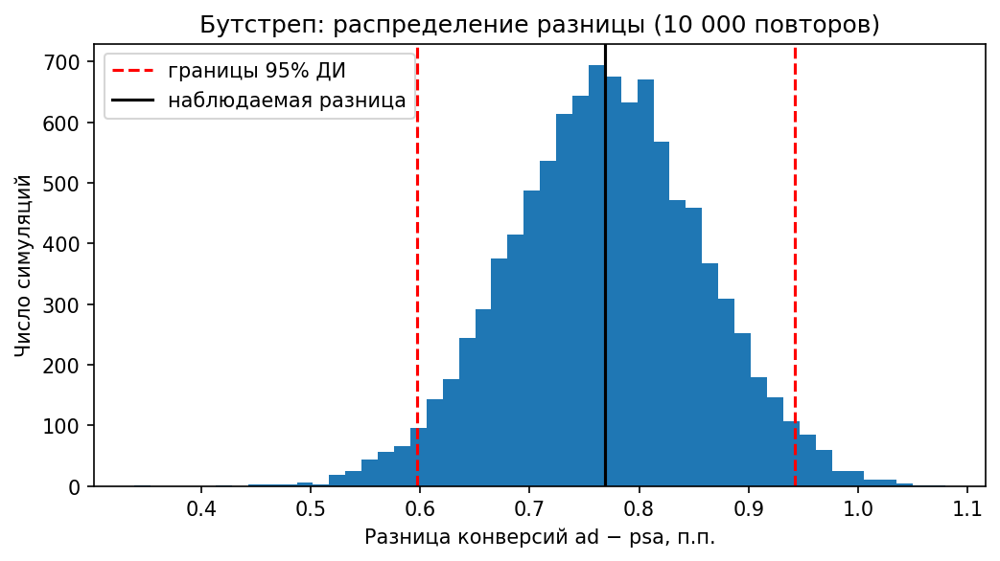

# A/B-тест рекламной кампании

Анализ A/B-теста: увеличивает ли реклама продукта конверсию в покупку по сравнению с социальной рекламой на тех же местах. Полный цикл — от проверки данных и дизайна теста до оценки эффекта в штуках покупок и разбора сегментов.

## Коротко о результате

**Реклама работает, кампанию стоит продолжать.**

| Показатель | Значение | 95% ДИ |
|---|---|---|
| Конверсия: реклама продукта (ad) | 2,55% | |
| Конверсия: соцреклама, контроль (psa) | 1,79% | |
| Разница | **+0,77 п.п.** | [0,60; 0,94] |
| Относительный прирост (lift) | **+43%** | [+30%; +57%] |
| Дополнительные покупки благодаря рекламе | **≈ 4 300** | [3 360; 5 330] |

z = 7,37, p ≈ 1,7·10⁻¹³. Результат подтверждён тремя способами: z-тест, χ² и бутстреп.

Главный бизнес-вывод: из 14 423 покупок в группе с рекламой рекламе обязаны только около 30%. Остальные 70% случились бы и без неё. Без контрольной группы эффект рекламы был бы завышен больше чем втрое.

## Данные

[Marketing A/B Testing](https://www.kaggle.com/datasets/faviovaz/marketing-ab-testing) (Kaggle): 588 101 пользователь, деление 96% / 4%.

- **ad** — тестовая группа, видела рекламу продукта;
- **psa** — контрольная группа, видела социальную рекламу (public service announcement) на тех же местах;
- метрика — конверсия в покупку (`converted`);
- дополнительно: число показов, день и час с наибольшим числом показов.

## Ход анализа

| Этап | Что сделано |
|---|---|
| 1. Данные | Загрузка, проверка дублей и пропусков, конверсия по группам (pandas и SQL с оконной функцией) |
| 2. SRM | Проверка, что фактическое деление совпадает с плановым 96/4 (χ², p = 0,9998) |
| 3. Мощность | MDE при фактическом делении — 0,25 п.п.; размер выборки для эффекта 0,3 п.п. при 50/50 и 96/4 |
| 4. Основной тест | z-тест для двух долей, ДИ разницы (Вальд), lift и его ДИ (дельта-метод по логарифму), сверка с χ² |
| 5. Бутстреп | 10 000 повторов, перцентильный ДИ — совпал с формульным |
| 6. Инкрементальность | Сколько покупок принесла реклама и сколько стоила контрольная группа |
| 7. Сегменты | Проверка баланса сегментов между группами, эффект по числу показов, дням и часам с поправкой Холма |



## Сегменты: что нашли и почему осторожно

- Число показов, день и час **распределены между группами по-разному** (χ², p < 10⁻²⁰). Эти признаки записаны во время теста, поэтому выводы по сегментам описательные, а не причинные.
- У двух третей пользователей (1–20 показов) значимой разницы нет; эффект сосредоточен у тех, кто видел 21+ показов. Но конверсия растёт с числом показов и в контрольной группе — значит, много показов видят более активные пользователи, и вывод «надо показывать чаще» отсюда не следует.
- По часам без поправки значимы 8 часов из 24, после поправки Холма — только один. Пример того, как множественные сравнения дают ложные находки.

## Рекомендации

1. Продолжать рекламную кампанию: эффект значим, и даже нижняя граница интервала вдвое выше порога в 0,3 п.п.
2. В следующих кампаниях сохранять небольшую контрольную группу — это единственный способ измерить реальный вклад рекламы, а не все покупки подряд.
3. Проверить влияние частоты показов отдельным экспериментом со случайным назначением числа показов.

## Ограничения

- В данных нет среднего чека и маржи — эффект выражен в покупках, не в деньгах.
- Неизвестно, как именно проводилось деление, сколько длился тест и есть ли повторные пользователи; анализ исходит из того, что деление случайное (SRM это не опровергает).
- Сегменты не сбалансированы между группами — выводы по ним описательные.
- В маленьких сегментах мощность низкая: «незначимо» там не означает «эффекта нет».

## Стек

Python (pandas, NumPy, SciPy, statsmodels, matplotlib), SQL (SQLite), Jupyter Notebook.

## Структура репозитория

```
├── data/                     # CSV не хранится в репозитории — скачать с Kaggle
├── images/                   # графики для README
├── notebooks/
│   └── ab_test_analysis.ipynb
└── README.md
```

## Как запустить

1. Скачать `marketing_AB.csv` с Kaggle и положить в папку `data/`.
2. Открыть `notebooks/ab_test_analysis.ipynb` и выполнить все ячейки (Kernel → Restart Kernel and Run All).
